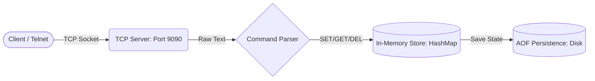

# 💾 Titan DB (Custom Key-Value Database)

**Titan DB** is a lightweight, high-performance in-memory key-value store built entirely in **Java**, inspired by tools like **Redis**. 

**Problem it solves:** When building small-scale distributed applications or microservices, introducing a heavy database dependency can sometimes be overkill. Titan DB aims to be a minimal, understandable, and fast networked cache and data store. It provides lightning-fast in-memory operations while ensuring data persistence to disk, making it a great learning project for understanding how real-world databases handle sockets, memory management, and file I/O.

## 🏛️ Architecture



## 🚀 Features
* **In-Memory Speed:** Stores data in RAM for microsecond-latency read/write operations.
* **Disk Persistence (AOF-like):** Automatically saves database state (`titan_core.db`) to disk to prevent data loss across restarts.
* **Networked Architecture:** Multi-client TCP server that accepts standard text-based network connections.
* **Custom Query Protocol:** Simple, text-based commands that are easy to parse and send.
* **Zero Dependencies:** Core engine built using only standard Java networking and I/O libraries.

## 🛠️ Tech Stack
* **Language:** Java (JDK 11+)
* **Networking:** `java.net.ServerSocket`, `java.net.Socket`
* **I/O:** standard `java.io` package for file handling
* **Testing:** JUnit 5
* **Build System:** Maven

## 📦 Project Structure
```text
Titan-Database-Java/
├── pom.xml
├── README.md
├── LICENSE
├── .gitignore
└── src/
    ├── main/java/com/titan/
    │   └── TitanEngine.java     # Main Server & DB Logic
    └── test/java/com/titan/
        └── TitanDBTest.java     # Integration Tests
```

## ⚙️ Installation & Build

You can compile and run this project using either Maven or standard `javac`.

**Using Maven:**
```bash
mvn clean package
mvn exec:java -Dexec.mainClass="com.titan.TitanEngine"
```

**Using Javac:**
```bash
javac src/main/java/com/titan/TitanEngine.java
java -cp src/main/java com.titan.TitanEngine
```

## 💻 Usage Examples & Session

Once the server is running, it listens on port `9090`. You can connect using `telnet` or `netcat` (`nc`).

```bash
# Connect to the database
$ telnet localhost 9090
# or
$ nc localhost 9090

# Expected output from server:
[TITAN] Baglanti bekleniyor...
[AG] Yeni baglanti kabul edildi...
```

### Supported Commands

| Command | Description | Example | Expected Output |
|---------|-------------|---------|-----------------|
| `SET <key> <value>` | Stores a value by key. | `SET name John` | `OK` |
| `GET <key>` | Retrieves a value by key. | `GET name` | `FOUND John` (or `NOT_FOUND`) |
| `DEL <key>` | Deletes a key-value pair. | `DEL name` | `OK` (or `NOT_FOUND`) |
| `LIST` | Returns the total count of keys. | `LIST` | `COUNT 1` |

### Example Client Session
```text
> SET user1 abdulkadir
OK
> GET user1
FOUND abdulkadir
> SET lang java
OK
> LIST
COUNT 2
> DEL user1
OK
> GET user1
NOT_FOUND
```

## 🧠 What I Learned
Building Titan DB has been an incredible deep dive into backend fundamentals. Rather than just using a database, I wanted to understand how one works under the hood. Through this project, I learned:
- **Socket Programming:** How to establish continuous, stable connections between a client and a server using TCP.
- **Thread & Concurrency Challenges:** Even though this is currently a basic iteration, managing client connections made me think deeply about blocking I/O vs. non-blocking I/O.
- **Data Persistence:** Writing custom formats to disk and reading them back efficiently without crashing the main application thread.
- **Protocol Design:** Implementing a simple text-based protocol helped me appreciate how HTTP and Redis protocols handle parsing overhead.

---
*Developed by Abdulkadir Turan as a Backend Development Portfolio Project.*